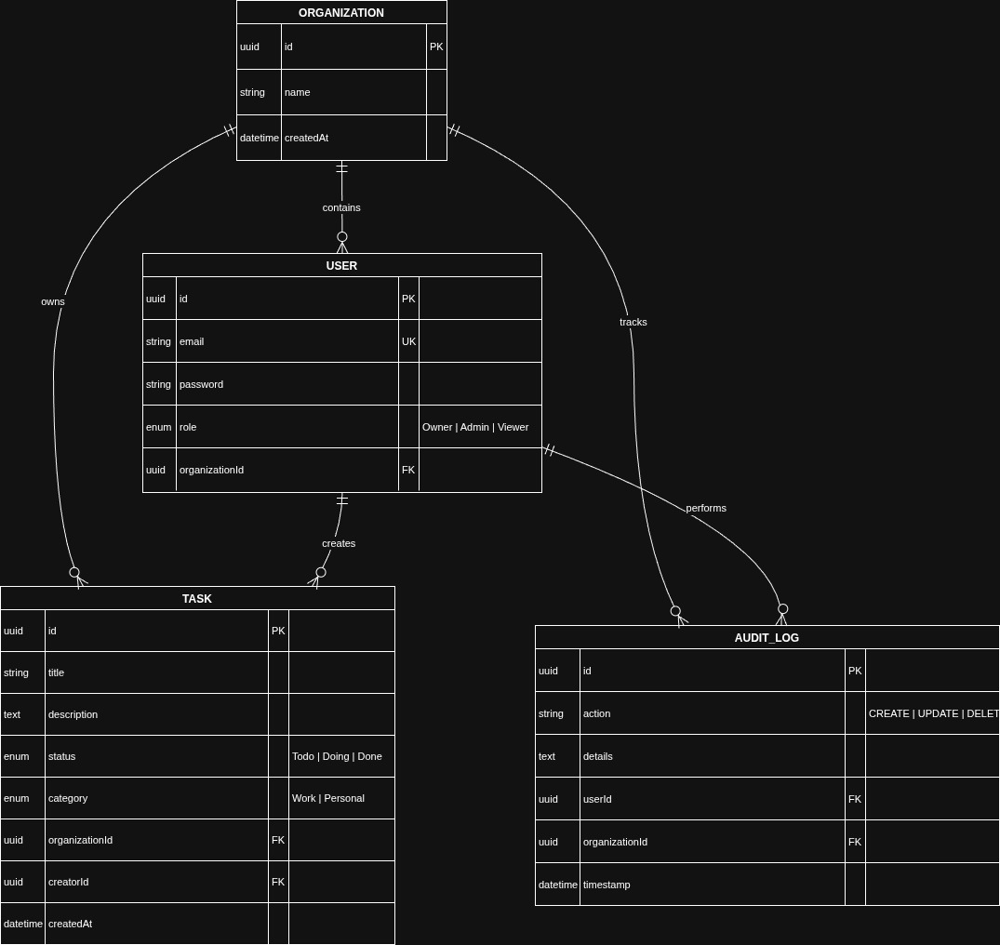

# TurboVets Secure Task Management Portal

A professional-grade, full-stack task management system built with **NestJS**, **Angular**, and the **Nx Monorepo** build system. This project demonstrates high-security standards including **Hierarchical Role-Based Access Control (RBAC)**, **multi-tenant data isolation**, and a reactive, high-performance UI. For **seed data** use **seed-data.sql** which is provided in the root directory with default password **password123** for all user logins.

---

## 🚀 Setup Instructions

### 1. Prerequisites
- Node.js (v18+)
- npm or yarn

### 2. Environment Setup

Create a `.env` file in the project root:

```env
# Database Configuration
DB_HOST=localhost
DB_PORT=5432
DB_USERNAME=roshan
DB_PASSWORD=roshan
DB_DATABASE=TurboVets

# Security
JWT_SECRET=TurboVetsSecretKey
```

### 3. Installation & Execution

```bash
# Install dependencies
npm install

# Run Backend (NestJS API)
npx nx serve api

# Run Frontend (Angular Dashboard)
npx nx serve dashboard
```

---

## 🏗 Architecture Overview

### Nx Monorepo Layout

This project uses an **Nx Monorepo** to maintain clear separation of concerns while enabling shared logic across the stack.

**Applications**
- `apps/api` — NestJS backend handling business logic, authentication, and security
- `apps/dashboard` — Angular 17+ standalone frontend application

**Shared Libraries**
- `libs/data` — Shared TypeScript interfaces, enums, and TypeORM entities
- `libs/auth` — Shared JWT utilities and RBAC guards

**Rationale**  
This structure minimizes code duplication (for example, shared `TaskStatus` enums between frontend and backend) and enables atomic, full-stack commits.

---

## 📊 Data Model Explanation

The schema is implemented using **TypeORM** with a focus on performance and secure data isolation.

### Schema Highlights



**Organization**
- Root tenant entity
- All data is scoped by organization

**User**
- Stores credentials and assigned role (`Owner`, `Admin`, `Viewer`)

**Task**
- Core domain resource
- Indexed by `organizationId` and `title` for fast scoped queries

**AuditLog**
- Append-only, read-only table
- Captures all destructive actions (`Create`, `Update`, `Delete`) for compliance

---

## 🔐 Access Control Implementation

### Hierarchical RBAC & Multi-Tenancy

Permissions flow downward through roles:

**Owner**
- Full administrative access
- Can delete tasks and view organization-wide audit logs

**Admin**
- Can create and update tasks
- Can view audit logs
- Cannot delete records

**Viewer**
- Read-only access to tasks and dashboard visualizations

### JWT Integration

**Authentication**
- JWT issued on login containing `userId`, `orgId`, and `role`

**Authorization**
- Requests pass through a NestJS `AuthGuard` and custom `RbacGuard`

**Data Scoping**
- `orgId` from the JWT payload is injected into every query
- Guarantees strict organization-level data isolation

---

## 🔌 API Documentation

### Task Endpoints

#### GET `/api/tasks`
**Filters**
- `search` (title or description)
- `category`
- `sort` (`ASC` / `DESC`)

**Sample Response**
```json
[
  {
    "id": "uuid",
    "title": "Implement JWT",
    "status": "Todo",
    "category": "Work"
  }
]
```

---

#### POST `/api/tasks`
**Role Required:** `Admin`, `Owner`

**Body**
```json
{
  "title": "New Task",
  "category": "Work"
}
```

---

#### PUT `/api/tasks/:id`
**Role Required:** `Admin`, `Owner`

**Body**
```json
{
  "status": "Doing"
}
```

---

#### DELETE `/api/tasks/:id`
**Role Required:** `Owner`

---

### Audit Log Endpoints

#### GET `/api/tasks/audit-log/all`
**Role Required:** `Admin`, `Owner`

**Description**  
Returns a chronological list of all security-relevant events within the organization.

---

## 🛠 Future Considerations

To evolve this project from a professional prototype to a production-ready enterprise platform:

### Advanced Security
- **Refresh Tokens**
  - Short-lived access token
  - Long-lived refresh token stored in an HttpOnly cookie

- **CSRF Protection**
  - Synchronizer Token Pattern for state-changing requests

### Performance & Scaling
- **RBAC Caching**
  - Cache roles and permissions in Redis to reduce database lookups

- **Database Partitioning**
  - Partition the `Task` table by `organizationId` as data scales

### Feature Enhancements
- **Role Delegation**
  - Allow Owners to define custom permission sets

- **Real-Time Collaboration**
  - WebSocket integration (Socket.io) for live Kanban updates
